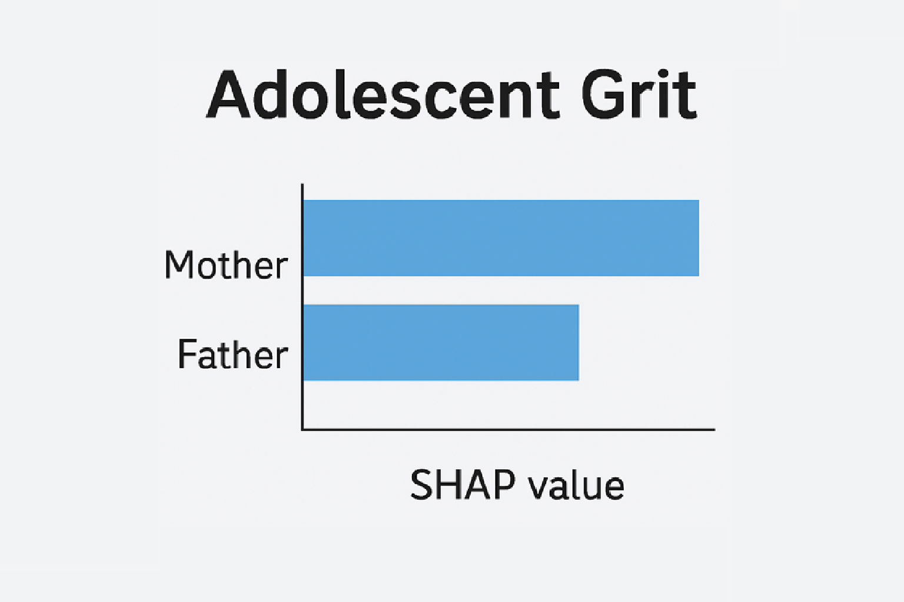
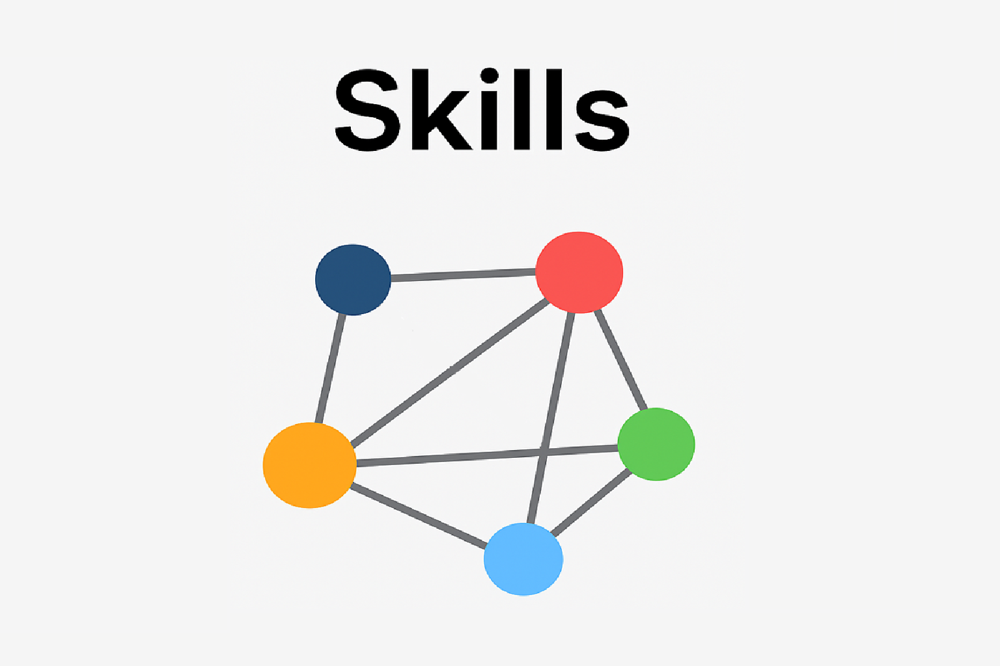

<!-- HERO -->
<h1 align="center">Marieth's GitHub</h1>

Data Scientist •  Machine Learning Engineer • Founder

<h2 align="center">Projects</h2>  
  
<table>
  <tr>
    <td align="center" width="33%">
      <a href="https://github.com/MariethCoetzer/Data_Science_Portfolio/blob/main/%5B03%5D%20Predicting%20Grit%20in%20Adolescents%20using%20Machine%20Learning/Predicting%20Grit%20in%20Adolescents%20using%20Machine%20Learning.ipynb">
        
         <b>Machine Learning</b>
      </a>
       Applied machine learning to predict grit in adolescents, uncovering behavioral insights using interpretable models 
    </td>
     <td align="center" width="33%">
      <a href="https://github.com/Braesemann/FounderPersonalities">
        
         <b>Data Engineering</b>
      </a>
       Implemented data anonymization, prepared and uploaded datasets, and authored documentation to support reproducibility
    </td>
    <td align="center" width="33%">
      <a href="https://github.com/MariethCoetzer/Data_Science_Portfolio/blob/main/%5B01%5D%20Identifying%20Complementary%20Skills%20using%20Network%20Analysis/%20Identifying%20Complementary%20Skills%20using%20Network%20Analysis.ipynb">
        
         <b>Network Analysis</b>
      </a>
       Applied network analysis to job postings to uncover complementary skills and identify upskilling pathways for the job market 
    </td>
  </tr>
</table>

